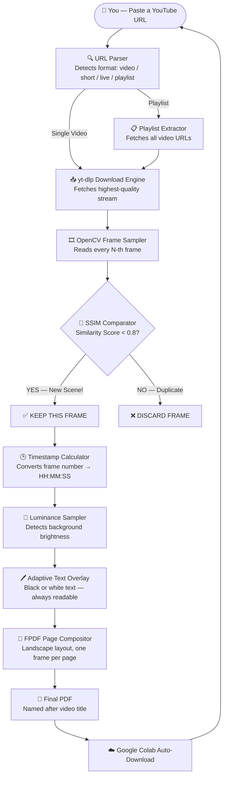
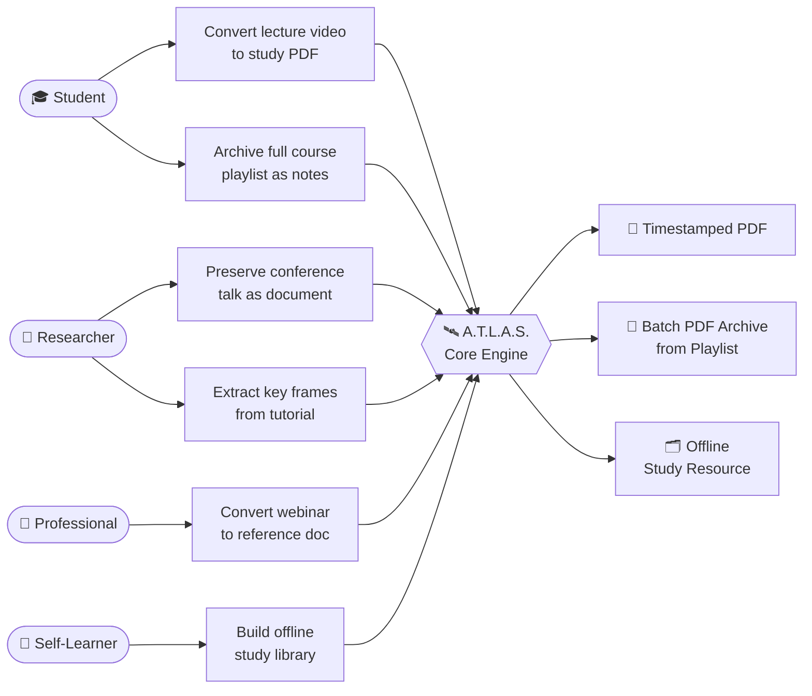

<div align="center" id="top">

<br/>


<br/>

*"Why watch for hours, when you can read in minutes?"*

<br/>

<p align="center">
  
  
  
  
  
</p>

<br/>

> 🎓 Built for students. &nbsp; 🔬 Trusted by researchers. &nbsp; ⚡ Powered by AI.
>
> **A.T.L.A.S.** converts any YouTube video into a clean, timestamped PDF — automatically.

<br/>

</div>

---

## 🚨🚨 CRITICAL — READ BEFORE YOU START 🚨🚨

<div align="center">

> ### ⛔ THIS PROJECT RUNS **ONLY** ON GOOGLE COLAB ⛔
>
> | Environment | Status |
> |:---:|:---:|
> | ☁️ Google Colab | ✅ **FULLY SUPPORTED** |
> | 💻 Local Jupyter Notebook | ❌ Will NOT work |
> | 🖥️ VS Code / PyCharm | ❌ Will NOT work |
> | 🖥️ Terminal / CMD | ❌ Will NOT work |
>
> **Why?** A.T.L.A.S. depends on Google Colab's built-in `files.download()` API and its pre-configured runtime environment. Running it outside Colab will break the file download system and dependency chain.

</div>

---

## 🟢 〔 SYSTEM OVERVIEW 〕 — What is A.T.L.A.S.?

**A.T.L.A.S.** is a Python-powered intelligent archival tool that takes any YouTube URL — be it a regular video, Short, live stream, or entire playlist — and converts it into a **beautifully structured, timestamped PDF document**.

Instead of watching a 3-hour lecture, you get a clean PDF with all the meaningful slides extracted, labelled with exact timestamps, and ready to study — in seconds.

> 🎯 **Core Goal:** Turn long video content into compact, readable, offline-friendly PDFs that save you hours.

<table>
<tr>
<td align="center" width="25%">📹<br/><b>Any YouTube URL</b><br/><sub>Videos, Shorts, Streams & Playlists</sub></td>
<td align="center" width="25%">🧠<br/><b>AI Frame Filtering</b><br/><sub>Only unique scenes are kept</sub></td>
<td align="center" width="25%">🕒<br/><b>Auto Timestamps</b><br/><sub>Every page knows its moment</sub></td>
<td align="center" width="25%">📄<br/><b>Instant PDF</b><br/><sub>Download in one click</sub></td>
</tr>
</table>

---

## ✨ 〔 CORE CAPABILITIES 〕 — Key Features

| Feature | What It Does |
|---|---|
| 🎥 **Multi-Format Support** | Works with Videos, Shorts, Live Streams & Playlists |
| 🧠 **SSIM Intelligence** | Structural Similarity Index filters out duplicate frames |
| 🚫 **Deduplication Engine** | Never saves two visually identical frames |
| 🕒 **Smart Timestamps** | Every PDF page shows the exact video timestamp |
| 🎨 **Adaptive Text Color** | Timestamp text auto-switches black/white for readability |
| 📐 **Landscape PDF Layout** | Clean slide-style pages — landscape orientation |
| 🔁 **Auto Retry on Failure** | Retries failed downloads up to 3 times automatically |
| 📦 **Playlist Batch Mode** | Converts an entire playlist into individual PDFs |
| ☁️ **One-Click Download** | Google Colab triggers download automatically |
| 🏷️ **Smart File Naming** | Output PDF is named after the original video title |

---

## 🏗️ 〔 NEURAL BLUEPRINT 〕 — System Architecture



---

## 🎭 〔 MISSION PROFILES 〕 — Use Case Diagram



---

## 🔄 〔 OPERATIONAL SEQUENCE 〕 — How It Works

```
  ╔══════════════════════════════════════════════════════════════════╗
  ║                                                                  ║
  ║   STEP 1 — INPUT                                                 ║
  ║   You paste a YouTube URL. That's it.                            ║
  ║                              ↓                                   ║
  ║   STEP 2 — DOWNLOAD                                              ║
  ║   yt-dlp fetches the best quality video stream silently.         ║
  ║                              ↓                                   ║
  ║   STEP 3 — FRAME SAMPLING                                        ║
  ║   OpenCV reads the video and samples every N-th frame.           ║
  ║                              ↓                                   ║
  ║   STEP 4 — INTELLIGENT FILTERING                                 ║
  ║   SSIM compares each frame to the last. Too similar? Skipped.    ║
  ║   Genuinely different scene? Saved.                              ║
  ║                              ↓                                   ║
  ║   STEP 5 — TIMESTAMP INSCRIPTION                                 ║
  ║   Each saved frame gets an HH:MM:SS timestamp burned in.         ║
  ║   Text color is auto-picked for maximum contrast.                ║
  ║                              ↓                                   ║
  ║   STEP 6 — PDF ASSEMBLY                                          ║
  ║   All frames stitched into a landscape PDF, one frame per page.  ║
  ║                              ↓                                   ║
  ║   STEP 7 — DOWNLOAD                                              ║ 
  ║   Your browser downloads the PDF named after the video.          ║
  ║                                                                  ║
  ╚══════════════════════════════════════════════════════════════════╝
```

---

## 🧰 〔 TECH MANIFEST 〕 — Stack & Libraries

<table>
<tr>
<th>Library</th>
<th>Version</th>
<th>Purpose</th>
</tr>
<tr><td>🐍 <b>Python</b></td><td>3.8+</td><td>Core runtime language</td></tr>
<tr><td>📥 <b>yt-dlp</b></td><td>Latest</td><td>YouTube stream downloading & playlist parsing</td></tr>
<tr><td>🎥 <b>OpenCV</b></td><td>4.x (headless)</td><td>Video decoding & frame extraction</td></tr>
<tr><td>🧠 <b>scikit-image</b></td><td>Latest</td><td>SSIM perceptual similarity computation</td></tr>
<tr><td>🖼️ <b>Pillow (PIL)</b></td><td>Latest</td><td>Frame manipulation & luminance analysis</td></tr>
<tr><td>📄 <b>FPDF</b></td><td>Latest</td><td>PDF construction and landscape layout</td></tr>
<tr><td>📐 <b>scipy</b></td><td>Latest</td><td>Distance computation utilities</td></tr>
<tr><td>☁️ <b>Google Colab</b></td><td>—</td><td>Runtime environment & one-click file download</td></tr>
</table>

---

## 🚀 〔 LAUNCH SEQUENCE 〕 — Getting Started

### Step 1 — Open Google Colab

👉 Go to [colab.research.google.com](https://colab.research.google.com) and open a **New Notebook**.

### Step 2 — Install Dependencies

Create a new cell and run:

```python
!pip install opencv-python-headless
!pip install scikit-image
!pip install fpdf
!pip install yt-dlp
```

### Step 3 — Paste the Code

Copy the full A.T.L.A.S. source code into the next cell.

### Step 4 — Run & Provide URL

Run the cell. You'll see this prompt:

```
Enter the YouTube video or playlist URL: ›
```

Paste your URL and press Enter.

### Step 5 — Get Your PDF ☁️

A.T.L.A.S. processes the video and your browser **automatically downloads** the PDF — named after the original video title.

---

## 🔗 〔 SIGNAL FORMATS 〕 — Supported URL Types

| URL Format | Type | Supported |
|---|---|:---:|
| `youtube.com/watch?v=ID` | Regular video | ✅ |
| `youtu.be/ID` | Short link | ✅ |
| `youtube.com/shorts/ID` | YouTube Shorts | ✅ |
| `youtube.com/live/ID` | Live stream recording | ✅ |
| `youtube.com/playlist?list=ID` | Full playlist (batch) | ✅ |

---

## 🔭 〔 FUTURE DIRECTIVES 〕 — Roadmap

| Priority | Feature | Details |
|:---:|---|---|
| 🔴 **Critical** | Whisper AI Transcription | Embed spoken text under each frame |
| 🔴 **Critical** | Local Execution Mode | Decouple from Colab for universal use |
| 🟡 **Planned** | Adjustable SSIM Threshold | Let users control frame sensitivity |
| 🟡 **Planned** | Chapter-Aware PDF Splitting | Use YouTube chapters as section dividers |
| 🟡 **Planned** | Streamlit / Gradio Web UI | Browser interface for non-coders |
| 🟢 **Future** | OCR Text Extraction | Capture text visible in slides via Tesseract |
| 🟢 **Future** | PDF Table of Contents | Navigable TOC with timestamp links |
| 🟢 **Future** | AI Caption Generation | LLM-written summary per frame |
| 🟢 **Future** | Multi-language UI | Localized display and timestamps |

---

## 💡 〔 TARGET USERS 〕 — Who Is This For?

**🎓 Students** — Turn a 2-hour lecture into a 30-page PDF before your exam. Every slide captured. Every second timestamped.

**🔬 Researchers** — Archive conference talks, demos, and seminars as permanent offline documents.

**💼 Professionals** — Convert webinars and training sessions into quick-reference guides for your team.

**📖 Self-Learners** — Build an offline library from tutorial playlists. Study anywhere, anytime, without internet.

**♿ Accessibility** — Get a readable, scannable alternative format to video content.

---

## ⚠️ 〔 SYSTEM CONSTRAINTS 〕 — Important Notes

> **Performance is best with:**
> - 🖥️ Clear screen-recording style videos (lectures, tutorials, presentations)
> - 🎞️ Videos with meaningful visual transitions
> - 📡 A stable internet connection during processing
>
> **Known Limitations:**
> - ⏱️ Very large playlists (50+ videos) may hit Colab session timeout
> - 🌐 Requires active internet — processes in real-time
> - 🖱️ No GUI — runs via Colab cell prompt only

---

## 📊 〔 SYSTEM STATUS 〕

```
  ┌────────────────────────────────────────────────┐
  │                                                │
  │   🛰️  A.T.L.A.S.   v1.0.0    🛰️               │
  │                                                │
  │   Stage        →   Active Development          │
  │   Platform     →   Google Colab (Exclusive)    │
  │   Stability    →   🟢 Stable 🟢               │
  │   Interaction  →   Prompt-Based                │
  │                                                │
  └────────────────────────────────────────────────┘
```

---

## 👤 〔 ARCHITECT 〕 — Author & Contact

<div align="center">

**Built with 💙 for every learner who said — *"I don't have time to watch this."***

<br/>

<table>
<tr>
<td align="center">
👤 <b>Author</b><br/>
Abhishek Kashyap
</td>
<td align="center">
📧 <b>Email</b><br/>
<a href="mailto:kashyapabhishek0212@gmail.com">kashyapabhishek0212@gmail.com</a>
</td>
<td align="center">
🐙 <b>GitHub</b><br/>
<a href="https://github.com/abhishekkashyap02">@abhishekkashyap02</a>
</td>
</tr>
</table>

<br/>

**Project Repository:** [A.T.L.A.S. — Automated Transcription & Lecture Archival System](https://github.com/abhishekkashyap02/A.T.L.A.S.)

<br/>

[](https://github.com/abhishekkashyap02)
[](mailto:kashyapabhishek0212@gmail.com)

<br/>

*Issues, ideas, and pull requests are always welcome.*

</div>

---

## 📄 〔 LEGAL 〕 — License

Released under the **MIT License** — free to use, modify, and distribute with attribution.

---

<div align="center">

<br/>


<br/>

⭐ *If A.T.L.A.S. saved you time, drop a star — it means the world!* ⭐

<br/>

[](#top)

</div>
